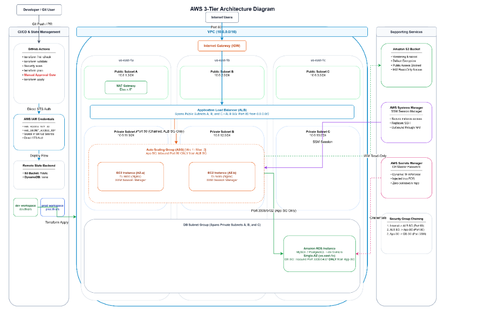

# 3-Tier AWS Infrastructure Deployment Using Terraform

This project provisions a scalable, secure 3-tier web application architecture on AWS using Terraform. The infrastructure is organized into reusable modules and deployed across two isolated environments (`dev` and `prod`) using Terraform Workspaces. Remote state is stored in an S3 bucket with distributed locking managed by DynamoDB.

## Architecture



```
                             Internet
                                │
                                ▼
                         Internet Gateway
                                │
   ─────────────────────────────┼─────────────────────────────
   Public Subnets (us-east-1a, us-east-1b, us-east-1c)
   ┌─────────────────────────────────────────────────────────┐
   │            Application Load Balancer (Port 80)          │
   │            NAT Gateway (in Public Subnet 1)             │
   └────────────────────────────┬────────────────────────────┘
                                │ HTTP :80 (ALB SG only)
   ─────────────────────────────┼─────────────────────────────
   Private Subnets (us-east-1a, us-east-1b, us-east-1c)
   ┌─────────────────────────────────────────────────────────┐
   │     Auto Scaling Group (t3.micro, Ubuntu 22.04)         │
   │     Nginx Web Server + Feedback Web Application         │
   │     AWS SSM Core Agent (Port 22 / SSH Closed)           │
   └────────────────────────────┬────────────────────────────┘
                                │ MySQL :3306 (App SG only)
   ─────────────────────────────┼─────────────────────────────
   Private DB Subnets (us-east-1a, us-east-1b, us-east-1c)
   ┌─────────────────────────────────────────────────────────┐
   │             Amazon RDS MySQL 8.0 (db.t3.micro)          │
   │             Credentials in AWS Secrets Manager          │
   └─────────────────────────────────────────────────────────┘
```

### Component Overview

| Layer | AWS Service | Configuration |
|---|---|---|
| Web Tier | Application Load Balancer | Public subnets across 3 AZs, listens on HTTP port 80 |
| App Tier | Auto Scaling Group | Private subnets, `t3.micro`, Nginx installed via user_data |
| Database Tier | Amazon RDS MySQL 8.0 | Private DB subnets, `db.t3.micro`, Single-AZ |
| Security | Security Groups & IAM | Chained SGs (ALB -> App -> DB), Zero SSH via SSM |
| Storage | Amazon S3 | S3 bucket with versioning, encryption, and public access blocked |
| State Backend | S3 + DynamoDB | S3 remote state storage with DynamoDB distributed locking |
| Workspaces | Terraform Workspaces | `dev` (`10.0.0.0/16`) and `prod` (`10.1.0.0/16`) |

## Design Decisions

### 1. 3-Tier Architecture and Subnet Isolation
The VPC is configured across three Availability Zones (`us-east-1a`, `us-east-1b`, `us-east-1c`) with three public subnets and three private subnets. Placing the compute instances and database in private subnets with no direct route to the Internet Gateway minimizes the public attack surface.

### 2. Security Group Chaining
Security groups are restricted by referencing source security group IDs instead of CIDR IP ranges:
- The ALB security group accepts inbound HTTP (port 80) from `0.0.0.0/0`.
- The App security group accepts inbound HTTP (port 80) only from the ALB security group ID.
- The DB security group accepts inbound MySQL (port 3306) only from the App security group ID.
- No direct traffic can reach the app instances or the database from the public internet.

### 3. SSH-Less Management via AWS Systems Manager
Port 22 is completely omitted from all security groups. Instead of distributing and rotating private SSH keys, an IAM instance profile with `AmazonSSMManagedInstanceCore` is attached to the launch template. Instances are accessed through AWS Systems Manager Session Manager in the browser or AWS CLI, with full auditing in AWS CloudTrail.

### 4. Dynamic Credentials via AWS Secrets Manager
No database passwords exist in Git, `.tfvars` files, or plain text outputs. Terraform generates a 16-character password using `random_password` and writes it to AWS Secrets Manager. The RDS instance consumes the password from memory, and the `rds_endpoint` output is marked `sensitive = true` to suppress it from pipeline logs.

### 5. Single Codebase with Terraform Workspaces
Rather than copying code into separate `dev/` and `prod/` directories, a single modular codebase is used. Environment-specific settings (VPC CIDR ranges, instance counts, RDS deletion protection) are supplied through `environments/dev.tfvars` and `environments/prod.tfvars`.

### 6. Remote State and Locking
Terraform state is stored in an S3 bucket with versioning and AES256 encryption. A DynamoDB table handles state locking to prevent concurrent modifications during team development or CI/CD execution.

### 7. IMDSv2 and ELB Health Checks
- IMDSv2 (`http_tokens = "required"`) is enforced on the launch template to mitigate SSRF vulnerabilities.
- ASG health checks are set to `ELB` rather than `EC2`, ensuring instances with failed Nginx processes are automatically replaced.

## Repository Structure

```
.
├── .github/
│   └── workflows/
│       ├── terraform-pr.yml       # PR checks: fmt, validate, Checkov scan, plan
│       └── terraform-apply.yml    # Main branch deployment with approval gate
├── app/                           # Web application files and templates
│   ├── app.py
│   ├── nginx.conf
│   ├── requirements.txt
│   └── templates/
│       ├── index.html
│       └── thankyou.html
├── environments/
│   ├── dev.tfvars                 # Dev parameters (1 instance, deletion protection off)
│   └── prod.tfvars                # Prod parameters (2-4 instances, deletion protection on)
├── modules/
│   ├── compute/                   # Launch template, ASG, ALB, listener, target group
│   ├── database/                  # RDS MySQL instance, Secrets Manager, random password
│   ├── monitoring/                # CloudWatch alarms for ALB 5xx and ASG CPU scaling
│   ├── network/                   # VPC, 6 subnets, IGW, NAT gateway, route tables
│   ├── security/                  # Chained security groups, IAM SSM role & policy
│   └── storage/                   # Encrypted S3 bucket with public access block
├── main.tf                        # Root module calling child modules
├── outputs.tf                     # Output declarations
├── providers.tf                   # AWS and Random provider definitions
├── variables.tf                   # Input variable declarations
├── versions.tf                    # Terraform requirements and S3 backend config
└── README.md
```

## Prerequisites

- Terraform >= 1.5.0
- AWS CLI v2 configured with valid credentials (`aws configure`)
- Git installed

## Deployment

### 1. One-Time Backend Setup

Create the S3 state bucket and DynamoDB table once before initializing Terraform:

```bash
# 1. Create S3 State Bucket
aws s3api create-bucket --bucket terraform-state-127228002868 --region us-east-1

# Enable versioning on the state bucket
aws s3api put-bucket-versioning --bucket terraform-state-127228002868 --versioning-configuration Status=Enabled

# 2. Create DynamoDB Lock Table
aws dynamodb create-table \
  --table-name terraform-state-locks \
  --attribute-definitions AttributeName=LockID,AttributeType=S \
  --key-schema AttributeName=LockID,KeyType=HASH \
  --billing-mode PAY_PER_REQUEST \
  --region us-east-1

# 3. Create CI/CD IAM User and Access Keys
aws iam create-user --user-name github-actions-deployer
aws iam attach-user-policy --user-name github-actions-deployer --policy-arn arn:aws:iam::aws:policy/AdministratorAccess
aws iam create-access-key --user-name github-actions-deployer
```

Add the generated `AccessKeyId` and `SecretAccessKey` to your GitHub Repository Secrets (`AWS_ACCESS_KEY_ID` and `AWS_SECRET_ACCESS_KEY`). Make sure the bucket name in `versions.tf` matches your S3 bucket.

### 2. Initialize and Create Workspaces

```bash
# Initialize Terraform
terraform init

# Create workspaces
terraform workspace new dev
terraform workspace new prod
```

### 3. Deploy Dev Environment

```bash
# Select dev workspace
terraform workspace select dev

# Plan and apply
terraform plan -var-file="environments/dev.tfvars"
terraform apply -var-file="environments/dev.tfvars" -auto-approve
```

### 4. Deploy Prod Environment

```bash
# Select prod workspace
terraform workspace select prod

# Plan and apply
terraform plan -var-file="environments/prod.tfvars"
terraform apply -var-file="environments/prod.tfvars" -auto-approve
```

## Verification

1. **Web Application:** Copy the `alb_dns_name` output and open `http://<alb_dns_name>` in a browser. Submit the feedback form to verify the submission screen.
2. **Health Check:** Open `http://<alb_dns_name>/health` to confirm HTTP 200 `OK`.
3. **Session Manager (Zero SSH):** In the AWS Console, open EC2 -> Instances -> Select instance -> Connect -> Session Manager -> Connect to confirm terminal access without SSH.
4. **Secrets Manager:** In AWS Secrets Manager, check that the database credentials secret has been created.

## CI/CD Pipeline

The GitHub Actions workflows under `.github/workflows/` automate the infrastructure delivery pipeline:

### Repository Secrets Required
Set the following secrets in GitHub (**Settings -> Secrets and variables -> Actions**):
- `AWS_ACCESS_KEY_ID`: AWS Access Key ID for CI/CD deployment
- `AWS_SECRET_ACCESS_KEY`: AWS Secret Access Key for CI/CD deployment

### Workflows
- **`terraform-pr.yml`**: Triggers on pull requests targeting `main`. Runs `terraform fmt -check`, `terraform validate`, Checkov security and compliance scan, and generates `terraform plan` matrix for both `dev` and `prod`.
- **`terraform-apply.yml`**: Triggers on pushes to `main`. Deploys `dev` automatically, outputs the ALB DNS URL, and holds `prod` behind manual approval.

## Teardown

To destroy provisioned resources and prevent cloud costs:

```bash
# Destroy Dev
terraform workspace select dev
terraform destroy -var-file="environments/dev.tfvars" -auto-approve

# Destroy Prod (ensure deletion_protection = false in prod.tfvars first)
terraform workspace select prod
terraform destroy -var-file="environments/prod.tfvars" -auto-approve
```
